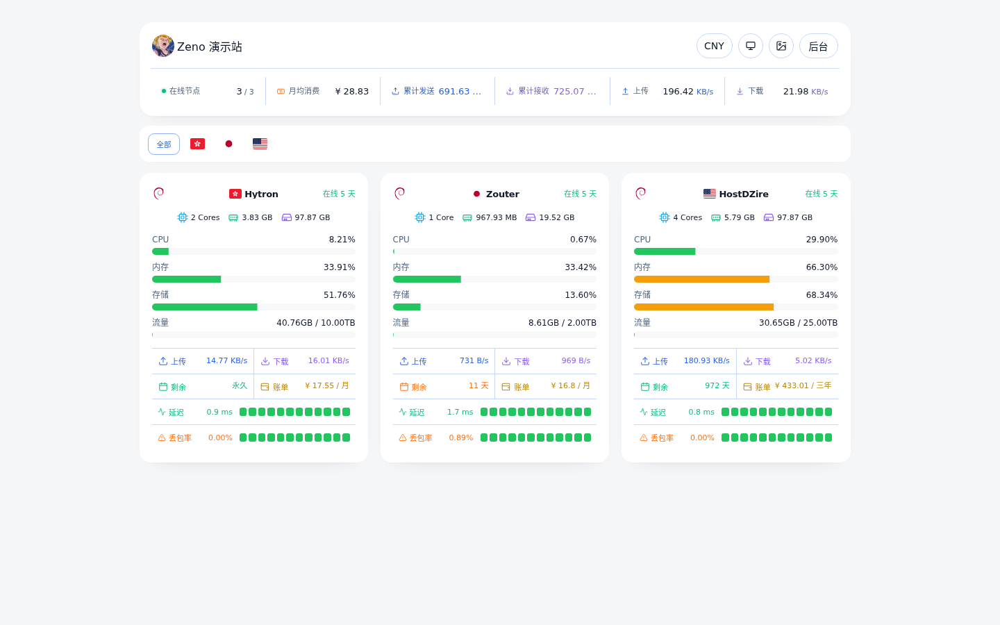
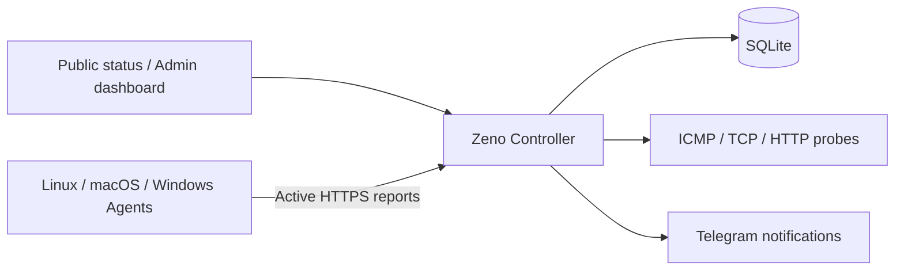

# Zeno

[](https://github.com/shui1iao/Zeno/actions/workflows/ci.yml)
[](https://github.com/shui1iao/Zeno/actions/workflows/codeql.yml)
[](https://github.com/shui1iao/Zeno/actions/workflows/docker.yml)
[](https://github.com/shui1iao/Zeno/releases)
[](LICENSE)

**A lightweight, self-hosted dashboard for server health, traffic, latency, and renewal costs.**

[Live demo](https://shuijiao.de/) · [Quick start](#quick-start) · [Deployment guide](docs/SELF_HOSTING.md) · [简体中文](README.md)



Zeno is built for individuals and small teams managing their own VPSs and servers. The Controller provides the web dashboard, APIs, SQLite storage, probes, and notifications; Agents actively report metrics from each server. Your data and credentials stay in your own infrastructure.

It is not a hosted SaaS and does not provide remote shells or command execution. Zeno stays focused on being auditable, easy to deploy, and safe to roll back.

## Why Zeno

- **See every server at a glance** — online state, system information, CPU, memory, disk, load, boot time, and Agent version in one dashboard.
- **Keep traffic totals across restarts** — lifetime traffic is persisted by the Controller; monthly accounting supports inbound, outbound, sum, max, and per-server reset days.
- **Find network problems faster** — inspect latency, packet loss, and history with ICMP Ping, TCP Ping, and HTTP GET probes.
- **Track what your servers cost** — record renewal amount, currency, and billing cycle, then normalize monthly spend with a daily cached exchange rate.
- **Get notified when something breaks** — Telegram supports offline, resource-threshold, and test notifications scoped to selected servers.
- **Share a responsive public status page** — server cards, overview metrics, node details, and service-latency details work on desktop and mobile.
- **Stay lightweight and self-hosted** — the Controller uses SQLite; the official Compose file binds to `127.0.0.1:18980` by default and runs with a non-root user and a read-only root filesystem.

## Quick start

### 1. Install the Controller

Prepare a Linux server with:

- `amd64`, `arm64`, or `arm/v6`
- Docker Engine 24+
- Docker Compose 2.20+
- At least 1 vCPU, 512 MiB available memory, and 1 GiB available disk space recommended

Run as root:

```bash
(
  set -Eeuo pipefail
  installer=$(mktemp)
  trap 'rm -f "$installer"' EXIT
  curl -fsSL https://zeno.shuijiao.de/install.sh -o "$installer"
  bash "$installer"
)
```

The installer deploys the currently recommended stable image and creates:

```text
/opt/zeno/.zeno-installation
/opt/zeno/docker-compose.yml
/opt/zeno/.env
/opt/zeno/data/zeno.db
/opt/zeno/secrets/zeno_admin_token
/opt/zeno/secrets/zeno_agent_token
```

The Controller listens on:

```text
http://127.0.0.1:18980
```

Do not expose `18980` directly to the internet. Put Caddy, Nginx, or another HTTPS reverse proxy in front of it and make sure WebSocket proxying is enabled.

```caddyfile
zeno.example.com {
    reverse_proxy 127.0.0.1:18980
}
```

Then open the admin panel and finish account setup. See [`docs/SELF_HOSTING.md`](docs/SELF_HOSTING.md) for complete public deployment, trusted-proxy, and first-login instructions.

### 2. Connect an Agent

The Agent lives in the separate [`shui1iao/Zeno-Agent`](https://github.com/shui1iao/Zeno-Agent) repository.

Create a server in the Zeno admin panel, select Linux, macOS, or Windows, and run the generated installation command on the target machine. The command contains a node-specific enrollment token that can be used once and expires after 10 minutes.

Official Agent support:

| System | Architectures | Service manager |
| --- | --- | --- |
| Linux | `amd64`, `arm64`, `armv6`, `armv7` | systemd |
| macOS | Intel, Apple Silicon | LaunchDaemon |
| Windows | `amd64`, `arm64` | Windows Service |

Controller and Agent releases are independent. See [`docs/COMPATIBILITY.md`](docs/COMPATIBILITY.md) for tested combinations, minimum versions, and deprecation policy.

## How it works



- **Controller** — web dashboard, Public/Admin APIs, Agent API, history, probes, and notifications.
- **Agent** — collects and actively reports metrics only; it exposes no remote command entry point and never modifies the Controller.
- **Storage** — local SQLite by default, with runtime data and secrets under `/opt/zeno`.

## Scope

Zeno is a good fit for individuals and small teams that want to control their own data and need focused monitoring plus a public status page.

It intentionally does not provide:

- Remote terminals, command execution, file management, or script jobs
- Multi-tenancy, OAuth, complex permissions, or notification-template systems
- Compatibility layers for Nezha, Komari, or Kulin APIs, databases, or Agent protocols

These boundaries keep deployment, upgrades, backups, and security review straightforward.

## Custom installation

The recommended stable image is convenient for a first deployment. For long-lived environments, pin `vX.Y.Z` or a digest during upgrades for reproducibility.

```bash
(
  set -Eeuo pipefail
  installer=$(mktemp)
  trap 'rm -f "$installer"' EXIT
  curl -fsSL https://zeno.shuijiao.de/install.sh -o "$installer"
  env \
    ZENO_INSTALL_DIR=/opt/zeno \
    ZENO_HOST_PORT=18980 \
    ZENO_IMAGE=ghcr.io/shui1iao/zeno:vX.Y.Z \
    ZENO_DB_CHECK_TIMEOUT=10m \
    bash "$installer"
)
```

`ZENO_DB_CHECK_TIMEOUT` controls the SQLite `quick_check` timeout during upgrades. It defaults to `10m`, accepts `s`, `m`, or `h`, and is capped at `24h`. The installer attempts an automatic rollback if the check fails or times out.

## Upgrade and rollback

Download and verify an installer for an explicit version:

```bash
version=vX.Y.Z
curl -fsS "https://zeno.shuijiao.de/$version/install.sh" -o install.sh
curl -fsS "https://zeno.shuijiao.de/$version/install.sh.sha256" -o install.sh.sha256
sha256sum -c install.sh.sha256
sudo env ZENO_IMAGE="ghcr.io/shui1iao/zeno:$version" bash install.sh
rm -f install.sh install.sh.sha256
```

Before upgrading, confirm the automatic backup directory and keep an additional off-host copy. The installer performs provenance checks, an offline backup, SQLite validation, and failure recovery. A manual rollback must restore compatible database schema and `secrets/`, not only the previous image.

See [`docs/UPGRADE.md`](docs/UPGRADE.md) for the complete procedure. After an upgrade, check:

```bash
curl -fsS http://127.0.0.1:18980/ready
```

## Documentation

| Topic | Document |
| --- | --- |
| Self-hosting, HTTPS, reverse proxies, and first login | [`docs/SELF_HOSTING.md`](docs/SELF_HOSTING.md) |
| Upgrades, backups, and rollback | [`docs/UPGRADE.md`](docs/UPGRADE.md) |
| Controller and Agent compatibility matrix | [`docs/COMPATIBILITY.md`](docs/COMPATIBILITY.md) |
| Public exposure, credentials, and notification keyrings | [`docs/SECURITY.md`](docs/SECURITY.md) |
| API | [`docs/API.md`](docs/API.md) |
| Support | [`SUPPORT.md`](SUPPORT.md) |

Redact diagnostics before opening an Issue. Never paste tokens, complete installation commands, Authorization headers, databases, backup contents, or notification credentials. Report vulnerabilities privately as described in [`SECURITY.md`](SECURITY.md).

## Data and security

- The SQLite database is stored at `/opt/zeno/data/zeno.db` by default.
- Admin and Agent tokens are stored under `/opt/zeno/secrets/` by default.
- Secret files should remain `root:10001` and `0640`; the official Compose file runs as UID/GID `10001:10001`.
- `data/` is owned by the runtime user; `secrets/` remains root-owned and read-only to the runtime group.
- Back up `/opt/zeno/data` and `/opt/zeno/secrets` regularly.
- Public access should use an HTTPS domain with a verifiable certificate. If the reverse proxy is not on the same loopback host, add only its actual source address to `ZENO_TRUSTED_PROXIES`.

## Development and contributing

```bash
go test ./...
npm --prefix web ci
npm --prefix web test -- --run
npm --prefix web run build
```

Build the Controller locally:

```bash
CGO_ENABLED=0 go build -o zeno-controller ./cmd/controller
```

Focused, verifiable contributions are welcome. Open an Issue first for protocol, database-schema, installer, or Public API changes. See [`CONTRIBUTING.md`](CONTRIBUTING.md) for the complete contribution requirements.

## Tech stack

- Controller: Go + SQLite
- Web: React + TypeScript + Vite
- Agent: separate Zeno-Agent releases
- Deployment: Docker Compose
- Communication: Agents actively report over HTTPS/JSON; Public/Admin APIs and the Agent API are separated

## License

[MIT](LICENSE)

If Zeno helps you, consider starring the repository so other people looking for lightweight self-hosted monitoring can find it.
