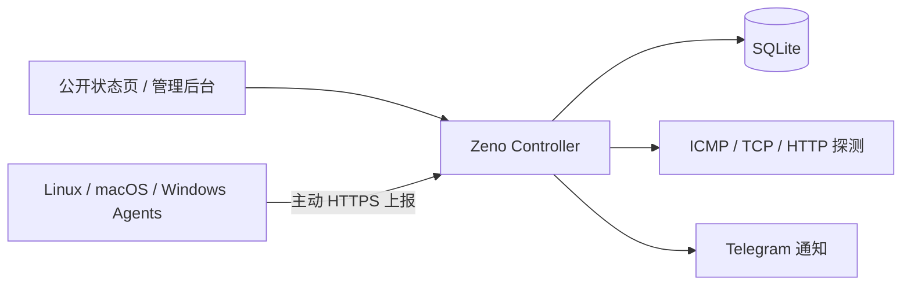

# Zeno

[](https://github.com/shui1iao/Zeno/actions/workflows/ci.yml)
[](https://github.com/shui1iao/Zeno/actions/workflows/codeql.yml)
[](https://github.com/shui1iao/Zeno/actions/workflows/docker.yml)
[](https://github.com/shui1iao/Zeno/releases)
[](LICENSE)

**轻量、自托管的服务器监控面板——统一查看状态、流量、延迟与续费。**

[在线演示](https://shuijiao.de/) · [快速开始](#快速开始) · [部署文档](docs/SELF_HOSTING.md) · [English](README.en.md)


Zeno 面向管理自有 VPS 和服务器的个人与小团队。Controller 提供 Web 面板、API、SQLite 数据库和通知，Agent 从各台服务器主动上报指标；数据和凭据留在你自己的基础设施中。

它不是托管 SaaS，也不提供远程终端或命令执行。你得到的是一个专注、可审计、容易部署和回滚的监控面板。

## 为什么选择 Zeno

- **一眼掌握服务器状态**：集中查看在线状态、系统信息、CPU、内存、磁盘、负载、启动时间和 Agent 版本。
- **流量不会因重启归零**：永久累计流量由 Controller 持久化；月流量支持入站、出站、合计、取较大值和独立重置日。
- **更快定位网络问题**：通过 ICMP Ping、TCP Ping 和 HTTP GET 查看延迟、丢包与历史趋势。
- **把续费成本一起算清楚**：记录金额、币种和周期，并按每日缓存汇率统一换算月均消费。
- **故障及时通知**：Telegram 支持离线、资源阈值和测试通知，可按服务器范围生效。
- **公开状态页直接可用**：服务器卡片、顶部概览、节点详情和服务延迟详情均适配桌面与移动端。
- **保持轻量与自托管**：Controller 使用 SQLite，官方 Compose 默认仅监听 `127.0.0.1:18980`，容器以非 root 用户和只读根文件系统运行。

## 快速开始

### 1. 安装 Controller

准备一台 Linux 服务器：

- `amd64`、`arm64` 或 `arm/v6`
- Docker Engine 24+
- Docker Compose 2.20+
- 建议至少 1 vCPU、512 MiB 可用内存、1 GiB 可用磁盘

以 root 身份执行：

```bash
(
  set -Eeuo pipefail
  installer=$(mktemp)
  trap 'rm -f "$installer"' EXIT
  curl -fsSL https://zeno.shuijiao.de/install.sh -o "$installer"
  bash "$installer"
)
```

安装器会部署当前推荐的稳定镜像，并创建：

```text
/opt/zeno/.zeno-installation
/opt/zeno/docker-compose.yml
/opt/zeno/.env
/opt/zeno/data/zeno.db
/opt/zeno/secrets/zeno_admin_token
/opt/zeno/secrets/zeno_agent_token
```

Controller 默认监听：

```text
http://127.0.0.1:18980
```

不要直接向公网暴露 `18980`。请先通过 Caddy、Nginx 或其他反向代理配置 HTTPS，并确保反代支持 WebSocket。

```caddyfile
zeno.example.com {
    reverse_proxy 127.0.0.1:18980
}
```

随后访问后台完成账号设置。完整公网部署、可信代理和首次登录步骤见 [`docs/SELF_HOSTING.md`](docs/SELF_HOSTING.md)。

### 2. 接入 Agent

Agent 位于独立仓库 [`shui1iao/Zeno-Agent`](https://github.com/shui1iao/Zeno-Agent)。

在 Zeno 后台创建服务器，选择 Linux、macOS 或 Windows，然后复制后台生成的安装命令到目标服务器执行。安装命令包含该节点专属的一次性 enrollment token；它只能使用一次，并在 10 分钟后过期。

官方 Agent 支持：

| 系统 | 架构 | 服务方式 |
| --- | --- | --- |
| Linux | `amd64`、`arm64`、`armv6`、`armv7` | systemd |
| macOS | Intel、Apple Silicon | LaunchDaemon |
| Windows | `amd64`、`arm64` | Windows Service |

Controller 与 Agent 独立发布。已验证组合、最低版本和弃用策略见 [`docs/COMPATIBILITY.md`](docs/COMPATIBILITY.md)。

## 工作方式



- **Controller**：Web 面板、Public/Admin API、Agent API、历史数据、探测和通知。
- **Agent**：只负责采集并主动上报，不开放远程命令入口，也不会修改 Controller。
- **存储**：默认使用本机 SQLite，运行数据与 secrets 均位于 `/opt/zeno`。

## 产品边界

Zeno 适合希望自己掌控数据、只需要轻量监控与公开状态页的个人和小团队。

它有意不提供：

- 远程终端、远程命令、文件管理或脚本任务
- 多租户、OAuth、复杂权限或通知模板系统
- Nezha、Komari、Kulin 的 API、数据库或 Agent 协议兼容层

这些边界让部署、升级、备份和安全审计保持简单。

## 自定义安装

首次体验可以使用安装器推荐的稳定镜像；长期运维建议升级时固定 `vX.Y.Z` 或 digest，以获得可复现部署。

```bash
(
  set -Eeuo pipefail
  installer=$(mktemp)
  trap 'rm -f "$installer"' EXIT
  curl -fsSL https://zeno.shuijiao.de/install.sh -o "$installer"
  env \
    ZENO_INSTALL_DIR=/opt/zeno \
    ZENO_HOST_PORT=18980 \
    ZENO_IMAGE=ghcr.io/shui1iao/zeno:vX.Y.Z \
    ZENO_DB_CHECK_TIMEOUT=10m \
    bash "$installer"
)
```

`ZENO_DB_CHECK_TIMEOUT` 控制升级时 SQLite `quick_check` 的最长时间，默认为 `10m`，支持 `s`、`m`、`h`，上限为 `24h`。检查失败或超时时，安装器会尝试自动回滚。

## 更新与回滚

使用明确版本下载并校验安装器：

```bash
version=vX.Y.Z
curl -fsS "https://zeno.shuijiao.de/$version/install.sh" -o install.sh
curl -fsS "https://zeno.shuijiao.de/$version/install.sh.sha256" -o install.sh.sha256
sha256sum -c install.sh.sha256
sudo env ZENO_IMAGE="ghcr.io/shui1iao/zeno:$version" bash install.sh
rm -f install.sh install.sh.sha256
```

升级前请确认自动备份目录，并额外保留一份异机备份。安装器会执行来源校验、离线备份、SQLite 检查和失败恢复；人工回滚时不要只切换镜像而忽略数据库 schema 与 `secrets/`。

完整说明见 [`docs/UPGRADE.md`](docs/UPGRADE.md)。升级后可检查：

```bash
curl -fsS http://127.0.0.1:18980/ready
```

## 文档

| 内容 | 文档 |
| --- | --- |
| 自托管、HTTPS、反向代理和首次登录 | [`docs/SELF_HOSTING.md`](docs/SELF_HOSTING.md) |
| 升级、备份与回滚 | [`docs/UPGRADE.md`](docs/UPGRADE.md) |
| Controller 与 Agent 兼容矩阵 | [`docs/COMPATIBILITY.md`](docs/COMPATIBILITY.md) |
| 公网边界、凭据与通知 keyring | [`docs/SECURITY.md`](docs/SECURITY.md) |
| API | [`docs/API.md`](docs/API.md) |
| 获取帮助 | [`SUPPORT.md`](SUPPORT.md) |

提交 Issue 前请先脱敏。不得粘贴 token、完整安装命令、Authorization header、数据库、备份内容或通知凭据。安全漏洞请按照 [`SECURITY.md`](SECURITY.md) 私下报告。

## 数据与安全

- SQLite 数据库默认位于 `/opt/zeno/data/zeno.db`。
- 管理员 token 和 Agent token 默认位于 `/opt/zeno/secrets/`。
- secret 文件应保持 `root:10001`、`0640`；官方 Compose 使用 UID/GID `10001:10001` 运行。
- `data/` 由运行用户持有，`secrets/` 由 root 持有并仅向运行组开放只读权限。
- 建议定期备份 `/opt/zeno/data` 和 `/opt/zeno/secrets`。
- 公网访问应使用可验证证书的 HTTPS 域名；反代不在同机 loopback 时，只把实际源地址加入 `ZENO_TRUSTED_PROXIES`。

## 开发与贡献

```bash
go test ./...
npm --prefix web ci
npm --prefix web test -- --run
npm --prefix web run build
```

构建本地 Controller：

```bash
CGO_ENABLED=0 go build -o zeno-controller ./cmd/controller
```

欢迎提交聚焦、可验证的改进。涉及协议、数据库 schema、安装器或 Public API 的修改，请先开 Issue；贡献要求见 [`CONTRIBUTING.md`](CONTRIBUTING.md)。

## 技术栈

- Controller：Go + SQLite
- Web：React + TypeScript + Vite
- Agent：独立的 Zeno-Agent Release
- 部署：Docker Compose
- 通信：Agent 主动通过 HTTPS/JSON 上报；Public/Admin API 与 Agent API 分离

## License

[MIT](LICENSE)

如果 Zeno 对你有帮助，欢迎点一个 Star，让更多需要轻量自托管监控的人看到它。
